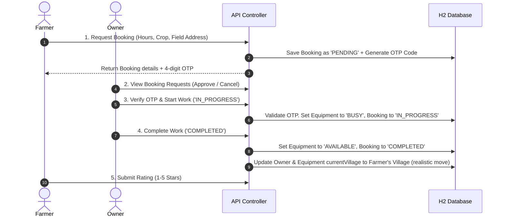

> **Former Machines** — *Uber for Farm Machinery in Rural India*

Former Machines is a dynamic web application and service booking platform designed to address the challenges of farm mechanization in rural India. The platform helps prevent crop losses during critical harvest seasons and eliminates equipment supply deficits by connecting smallholder Indian farmers with local machinery owners to democratize high-tech agricultural access.

---

## 📖 Table of Contents
1. [Overview & Main Features](#-overview--main-features)
2. [Technology Stack](#%EF%B8%8F-technology-stack)
3. [System Architecture & Workflow](#-system-architecture--workflow)
4. [Data Models & Entity Schema](#-data-models--entity-schema)
5. [Seeded Simulation Data](#-seeded-simulation-data)
6. [API Endpoints Reference](#-api-endpoints-reference)
7. [Running & Deployment Instructions](#-running--deployment-instructions)

---

## 🌟 Overview & Main Features

### 1. Persona-Driven Portals
*   **Farmer Portal (Hire Machinery):** Farmers can view and filter available machinery in their vicinity, request bookings with specific field addresses/hours/crops, and track request status with OTP validation details.
*   **Machinery Owner Portal (Host Machinery):** Owners can list their tractors, harvesters, and rotavators with specific rates (₹/hour) and performance metrics (acres/hour). They can manage availability, view requests, and update booking stages.
*   **Administrator Dashboard:** Admins have complete visibility over all platform users and bookings, with capabilities to search, update details, delete accounts, and oversee rentals.

### 2. Interactive SVG Network Map
*   Renders a complete virtual topology of rural villages (nodes) and connecting dirt/tarmac roads (edges).
*   Visualizes the live fleet counts dynamically as badges on top of village nodes.
*   Users can click nodes on the SVG map to select start/destination nodes for routing.

### 3. Dijkstra Shortest Path Routing
*   An integrated pathfinding service dynamically calculates shortest routes between villages using Dijkstra's algorithm.
*   Provides accurate distances used for dispatch cost estimation, routing, and simulator movement.

### 4. OTP-Verified Security Flow
*   Bookings utilize a secure OTP (One-Time Password) workflow. 
*   When machinery arrives at the farm, the operator must verify a unique 4-digit OTP provided by the farmer in order to transition the booking status to `IN_PROGRESS` and begin billing.

### 5. Multi-Language Translation
*   Features a language switching menu integrated with Google Translate, offering seamless UI experiences in regional Indian languages including **Hindi (हिन्दी), Telugu (తెలుగు), Tamil (தமிழ்), Kannada (ಕನ್ನಡ), Marathi (मराठी), Punjabi (ਪੰਜਾਬੀ), Gujarati (ગુજરાતી), and English**.

---

## 🛠️ Technology Stack

*   **Backend Framework:** Spring Boot 3.2.5 (Java 17)
*   **Persistence Layer:** Spring Data JPA (Hibernate)
*   **Database:** H2 In-Memory Database (with H2 console enabled at `/h2-console`)
*   **Frontend UI:** Single Page Application (SPA) built using HTML5, Vanilla JavaScript, and custom styling with glassmorphism effects and interactive background cursor glows.
*   **Iconography & Typography:** FontAwesome 6.4.0 & Google Fonts (Outfit, Inter)
*   **Build Tool:** Maven
*   **Containerization:** Multi-stage Dockerfile (Maven 3.8.5 + Eclipse Temurin 17 JRE)

---

## 🔄 System Architecture & Workflow



---

## 🗄️ Data Models & Entity Schema

### 1. User (`User.java`)
Represents platform users: farmers, equipment owners, and administrators.
| Field | Type | Description |
| :--- | :--- | :--- |
| `id` | `Long` (PK) | Auto-incremented primary key. |
| `phone` | `String` | Unique 10-digit mobile number used for login/registration. |
| `name` | `String` | Full name of the user. |
| `role` | `String` | Role category: `"FARMER"`, `"OWNER"`, or `"ADMIN"`. |
| `aadhaar` | `String` | 12-digit Aadhaar Card Number (required for owners/admins). |
| `drivingLicense`| `String` | Driver's License Number (required for owners/admins). |
| `isAvailable` | `Boolean` | Availability toggle for operators (similar to ride-sharing drivers). |
| `currentVillage`| `Village` (FK) | Reference to the current village location. |

### 2. Equipment (`Equipment.java`)
Machinery rented out by owners.
| Field | Type | Description |
| :--- | :--- | :--- |
| `id` | `Long` (PK) | Auto-incremented primary key. |
| `owner` | `User` (FK) | Reference to the `User` owner (must have `"OWNER"` role). |
| `type` | `String` | Machinery classification: `"TRACTOR"`, `"HARVESTER"`, or `"ROTAVATOR"`. |
| `brandModel` | `String` | Brand name and version (e.g., `"Mahindra Arjun 555"`). |
| `regNumber` | `String` | Official license/registration plate number. |
| `costPerHour` | `Double` | Hourly rental rate in Indian Rupees (₹). |
| `acresPerHour` | `Double` | Operational efficiency (acres covered per hour). |
| `description` | `String` | Brief details about attachments and machine conditions. |
| `status` | `String` | Live status: `"AVAILABLE"`, `"BUSY"`, or `"OFFLINE"`. |
| `currentVillage`| `Village` (FK) | Current geographical village location of the machinery. |

### 3. Booking (`Booking.java`)
Rental transaction tracking.
| Field | Type | Description |
| :--- | :--- | :--- |
| `id` | `Long` (PK) | Auto-incremented primary key. |
| `farmer` | `User` (FK) | Reference to the `"FARMER"` who booked the machine. |
| `equipment` | `Equipment` (FK)| Reference to the rented machine. |
| `hours` | `Integer` | Total rental duration requested. |
| `cropType` | `String` | Targeted crop for harvest/tillage (e.g. `"Wheat"`, `"Rice"`). |
| `fieldAddress` | `String` | Address details where operations will take place. |
| `status` | `String` | Lifecycle: `"PENDING"`, `"APPROVED"`, `"IN_PROGRESS"`, `"COMPLETED"`, `"CANCELLED"`. |
| `otpCode` | `String` | 4-digit security code generated for work-start validation. |
| `rating` | `Integer` | Feedback rating between 1 (poor) and 5 (excellent). |
| `totalCost` | `Double` | Calculated rental fee: `hours * costPerHour`. |
| `requestDate` | `LocalDateTime` | Timestamp when the booking request was submitted. |

### 4. Village (`Village.java`)
Nodes representing agricultural sectors on the map grid.
| Field | Type | Description |
| :--- | :--- | :--- |
| `id` | `Long` (PK) | Auto-incremented primary key. |
| `name` | `String` | Unique name of the village (e.g., `"Rampur"`). |
| `xCoord` | `Integer` | X-coordinate on the SVG map (scale `0` to `100`). |
| `yCoord` | `Integer` | Y-coordinate on the SVG map (scale `0` to `100`). |

### 5. Road (`Road.java`)
Bi-directional weighted connections between village nodes.
| Field | Type | Description |
| :--- | :--- | :--- |
| `id` | `Long` (PK) | Auto-incremented primary key. |
| `u` | `String` | Name of the starting village. |
| `v` | `String` | Name of the destination village. |
| `distance` | `Double` | Road weight/distance in kilometers (km). |

---

## 🌾 Seeded Simulation Data

The database automatically populates a baseline network topology and user base on startup for demonstration and testing:

### 1. Village Coordinates
*   **Rampur:** (35, 50)
*   **Pipri:** (55, 35)
*   **Kalyanpur:** (15, 65)
*   **Sonpur:** (75, 25)
*   **Bilaspur:** (25, 85)
*   **Rajpur:** (90, 15)
*   **Gopalpur:** (95, 45)

### 2. Road Distances
*   Rampur ↔ Pipri: **5.0 km**
*   Rampur ↔ Kalyanpur: **8.0 km**
*   Pipri ↔ Sonpur: **6.0 km**
*   Kalyanpur ↔ Sonpur: **4.0 km**
*   Kalyanpur ↔ Bilaspur: **12.0 km**
*   Sonpur ↔ Rajpur: **9.0 km**
*   Bilaspur ↔ Rajpur: **5.0 km**
*   Rajpur ↔ Gopalpur: **7.0 km**

### 3. Pre-seeded Users
| Name | Role | Phone | Location | Details |
| :--- | :--- | :--- | :--- | :--- |
| **Rajesh Kumar** | `FARMER` | `9876543210` | Rampur | Seeded Farmer |
| **Ramesh Singh** | `FARMER` | `8765432109` | Pipri | Seeded Farmer |
| **Suresh Yadav** | `FARMER` | `7654321098` | Kalyanpur | Seeded Farmer |
| **Amit Patel** | `OWNER` | `9988776655` | Sonpur | Seeded Owner |
| **Vijay Verma** | `OWNER` | `8877665544` | Bilaspur | Seeded Owner |
| **Harpreet Singh** | `OWNER` | `7766554433` | Rajpur | Seeded Owner |
| **Admin** | `ADMIN` | `8187872374` | Rampur | Platform Administrator |

### 4. Seeded Equipment
*   **John Deere 5050D** (Tractor) - ₹500/hr, 1.2 acres/hr | Owner: *Amit Patel* (Sonpur)
*   **Mahindra Arjun 555** (Tractor) - ₹450/hr, 1.0 acres/hr | Owner: *Amit Patel* (Sonpur)
*   **Kubota MU4501** (Tractor) - ₹480/hr, 1.1 acres/hr | Owner: *Vijay Verma* (Bilaspur)
*   **Preet 987** (Harvester) - ₹1500/hr, 2.5 acres/hr | Owner: *Vijay Verma* (Bilaspur)
*   **Sonalika Tiger** (Rotavator) - ₹300/hr, 1.5 acres/hr | Owner: *Harpreet Singh* (Rajpur)
*   **Kartar 4000** (Harvester) - ₹1400/hr, 2.2 acres/hr | Owner: *Harpreet Singh* (Rajpur)

---

## 🔌 API Endpoints Reference

All requests and responses use JSON formatting. The context base URL path is `/api`.

### 1. Villages & Roads
*   `GET /api/villages` - List all seeded village nodes.
*   `GET /api/roads` - List all road segments.

### 2. User Authentication & Profile
*   `POST /api/users/login` - Verify user presence by mobile.
    *   *Payload:* `{"phone": "9876543210"}`
*   `POST /api/users/register` - Create a new user profile.
    *   *Payload:* `{"phone": "9876543210", "name": "Name", "role": "FARMER", "currentVillageId": 1}`
*   `GET /api/users` - Fetch users (optional filter `?role=FARMER`).
*   `PUT /api/users/{id}` - Admin-driven updates for user details.
*   `PUT /api/users/{id}/availability` - Toggle owner service availability.
*   `PUT /api/users/{id}/location` - Move a user's location. Automatically shifts linked owner equipment locations.
*   `DELETE /api/users/{id}` - Delete user profile (cascade deletes linked fleet & bookings). Admins cannot be deleted.

### 3. Equipment Inventory
*   `GET /api/equipment` - Fetch machinery inventory (optional filters: `?type=TRACTOR` or `?status=AVAILABLE`).
*   `POST /api/equipment` - Register a new machine into the fleet.
*   `PUT /api/equipment/{id}/status` - Set equipment status.

### 4. Booking Transactions
*   `GET /api/bookings` - Fetch all bookings (optional filters: `?farmerId=1` or `?ownerId=2`).
*   `POST /api/bookings` - Submit a machinery request.
    *   *Payload:* `{"farmerId": 1, "equipmentId": 2, "hours": 4, "cropType": "Wheat", "fieldAddress": "Field 3"}`
*   `PUT /api/bookings/{id}/status` - Modify booking state.
    *   *Note:* Starting work requires OTP verification.
    *   *Payload:* `{"status": "IN_PROGRESS", "otp": "4815"}` or `{"status": "COMPLETED"}`
*   `PUT /api/bookings/{id}/rate` - Review the booking service.
    *   *Payload:* `{"rating": 5}`

### 5. Pathfinding Utility
*   `GET /api/path?start={startName}&end={endName}` - Returns the shortest path and distance sequence.
    *   *Response Example:* `{"distance": 11.0, "path": ["Rampur", "Pipri", "Sonpur"]}`

---

## 🚀 Running & Deployment Instructions

### Local Development Setup

#### Prerequisites
*   Java Development Kit (JDK) 17 or higher
*   Apache Maven 3.8+ (or use the embedded Maven wrapper `./mvnw`)

#### Run Commands
1.  Clone/Extract the project directory.
2.  Navigate to the project root directory.
3.  Compile and start the server using Maven:
    ```bash
    mvn spring-boot:run
    ```
4.  Open your browser and navigate to:
    ```http
    http://localhost:8080
    ```
5.  To access the in-memory H2 database console:
    *   **URL:** `http://localhost:8080/h2-console`
    *   **JDBC URL:** `jdbc:h2:mem:formermachines`
    *   **User Name:** `sa`
    *   **Password:** *(leave blank)*

---

### Docker Deployment

A multi-stage Docker build is ready to compile and run the application inside a container.

#### Building the Image
```bash
docker build -t former-machines .
```

#### Running the Container
```bash
docker run -d -p 8080:8080 --name former-machines-app former-machines
```
The server will start up, exposing the application on port `8080`.
